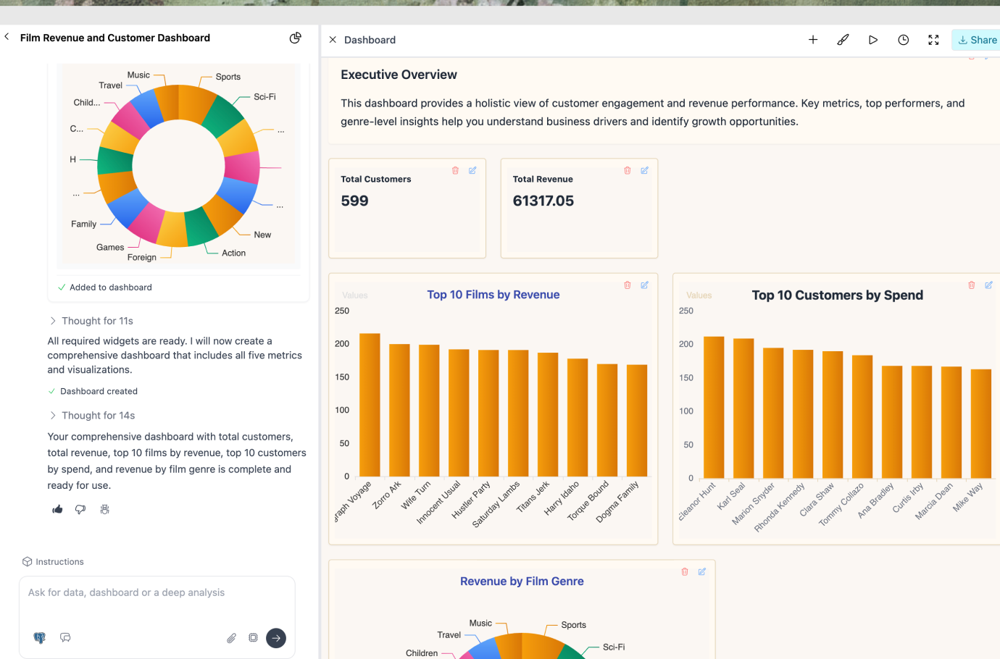

# LLM-Powered-Data-Analyst
Demo: 

    

**Chat with any data source** 

  Ask questions in web, Slack, or else. Create charts, tables, and full beautiful reports/dashboards by chatting with your data—powered by an agentic loop for tool use, reflection, and reasoning.

*  **Context-aware & customizable** 
  
   Define terms, tables, KPIs, rules and instructions. Ingest from dbt, Tableau, code, AGENTS.md, and have AI continiously maintain and monitor.

* **Any LLM, any data**

   Connect multiple data sources: Snowflake, BigQuery, Redshift, Postgres, dbt, Tableau, and more — then pair with the LLM of your choice (OpenAI, Anthropic, or local models). Swap models/data sources without breaking workflows.

*  **Transparency, trust & deployment**

   Track every AI decision, trace, and feedback. Analyze quality and usage in the console. Deploy fully in your VPC with Docker/Compose, VMs, or Kubernetes.

   ### Supported LLM Integrations

Bag of words supports a wide range of LLM providers out of the box. You can bring your own API key for any of the following:

| Provider         | Supported Models / APIs         | Notes                                                                 |
|------------------|---------------------------------|-----------------------------------------------------------------------|
| **OpenAI**       | GPT-5, GPT-4.1, o-models, etc.    | Any OpenAI-compatible endpoint (including self-hosted, vLLM, etc.)    |
| **Azure OpenAI** | GPT-5, GPT-4.1, o-models, etc.            | Azure resource/endpoint support, including model deployment names      |
| **Google Gemini**| Gemini 2.5, Flash versions, etc.    | Requires Google Cloud API key                                         |
| **Anthropic**    | Claude, Sonnet, Haiku    | Just provide the API key          |
| **Any OpenAI-compatible** | vLLM, LM Studio, Ollama, etc. | Just provide the base URL and API key                                 |

> **Tip:** You can configure multiple providers and models, set defaults, and more.
